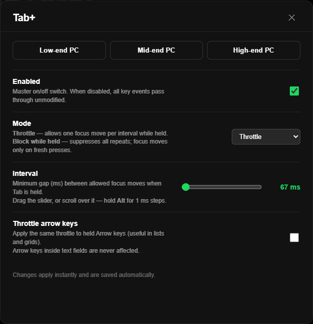

# Tab+ · [Russian](./README-Rus.md)

A [Spicetify](https://spicetify.app) extension that fixes the UI freeze caused by holding the **Tab** key in Spotify.



---

## The Problem

When you hold Tab, Chromium (the engine behind Spotify's desktop app) fires **30–50 `keydown` events per second**. Each one triggers Spotify's focus management, which rebuilds the React accessibility tree for the newly focused element. At that rate, the JS thread saturates and the UI completely freezes.

## The Fix

Tab+ intercepts keyboard events in the **capture phase** (before any Spotify listener and before the browser's default focus action). For auto-repeated events (`e.repeat === true`), it either:

- **Throttle mode** — allows one focus move per configurable interval (default: 225 ms)
- **Block mode** — suppresses all repeats; focus moves only on fresh manual presses

Single presses are never affected.

---

## Features

- Instant fix for the held-Tab freeze with no Spotify restart needed after config changes
- Three hardware presets: **Low-end PC** (350 ms), **Mid-end PC** (225 ms), **High-end PC** (100 ms)
- Fine-grained interval slider (50–1500 ms), scrollable with the mouse wheel
  - Hold **Alt** while scrolling or dragging for **1 ms precision**
- Optional Arrow-key throttling for lists and grids (skipped inside text fields)
- Block mode for maximum protection on very weak hardware
- Settings UI accessible from the Spotify profile menu
- Config persisted in `localStorage` — survives Spotify restarts

---

## Installation

### Via Spicetify Marketplace *(recommended)*

1. Open Spotify → profile menu → **Marketplace**
2. Search for **Tab+**
3. Click **Install**

### Manual

1. Download `tabplus.js`
2. Copy it to your Spicetify extensions folder:
   - **Windows:** `%APPDATA%\spicetify\Extensions\`
   - **macOS/Linux:** `~/.config/spicetify/Extensions/`
3. Run:
   ```
   spicetify config extensions tabplus.js
   spicetify apply
   ```

---

## Usage

Open Spotify → click your **profile picture** → **Tab Throttle Settings**

| Setting | Description |
|---|---|
| **Enabled** | Master on/off switch |
| **Mode** | Throttle (slow down) or Block (no movement while held) |
| **Interval** | Gap in ms between allowed focus moves (throttle mode only) |
| **Throttle arrow keys** | Apply the same fix to held Arrow keys in lists/grids |

### Presets

| Preset | Interval | Arrow throttle |
|---|---|---|
| Low-end PC | 350 ms | ✅ |
| Mid-end PC | 225 ms | ❌ |
| High-end PC | 100 ms | ❌ |

---

## License

[MIT](LICENSE)
